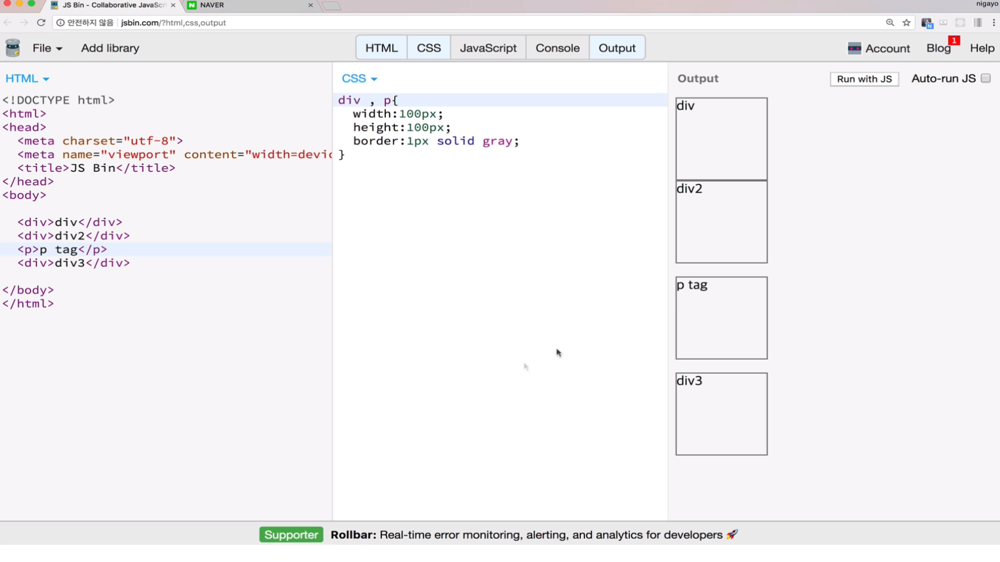
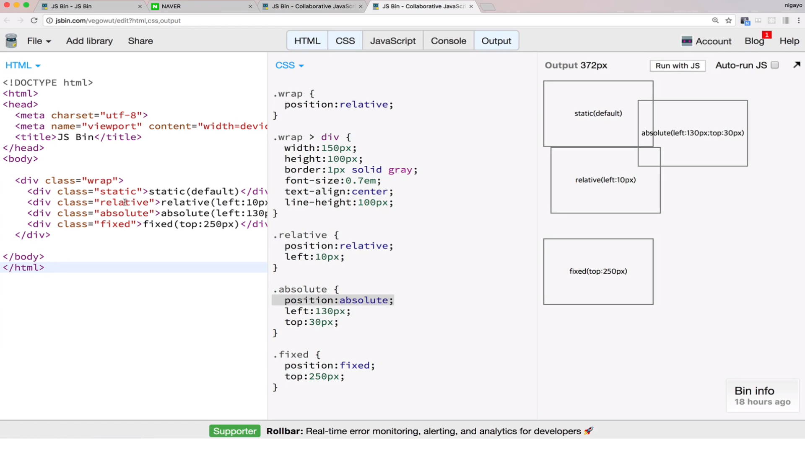
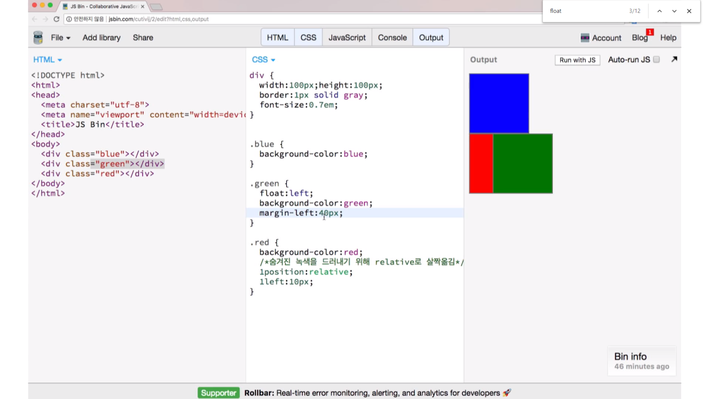
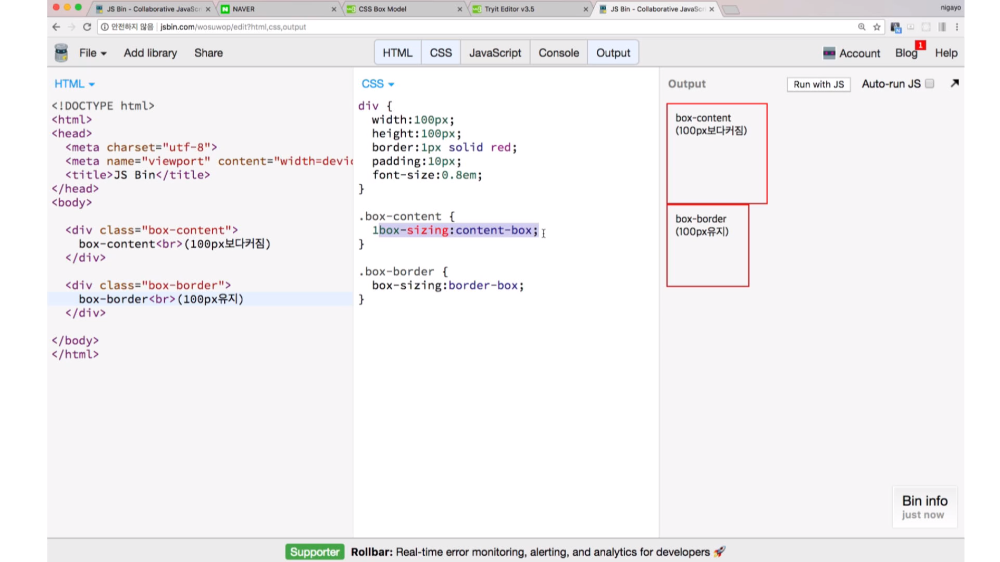

## CSS 기본 Style 변경하기

### 웹 폰트

엘리먼트가 배치되는 방식

엘리먼트를 화면에 배치하는 것을 layout 작업이라고도 하고, Rendering 과정이라고도 합니다.편의상 우리는 배치라고 할 겁니다.
기본 엘리먼트는 위에서 아래로 배치되는 것이 기본입니다.
하지만 웹사이트의 배치는 다양하게 표현 가능해야 하므로, 이를 다양한 방식으로 배치할 수 있도록 다양한 속성을 활용합니다.
중요하게 이해해야 할 속성은 다음과 같습니다.

~~~
display(block, inline, inline-block)
position(static, absolute, relative, fixed)
float(left, right) (기본 element를 벗어나서 둥둥떠다니는 느낌)
~~~

### display

display:block = 위에서부터 쌓이는 느낌 
div는 display가 블럭속성이기 때문에 그렇다.

 

display:inline = 옆으로 흐르는 느낌
display 속성이 inline인 경우는 우측으로, 그리고 아래쪽으로 빈자리를 차지하며 흐릅니다.
높이와 넓이를 지정해도 반영이 되지 않습니다.

### position
엘리먼트 배치가 순서대로만 위아래로 또는 좌우로 흐르면서 쌓이기만 하면, 다양한 배치를 하기 어렵습니다.
position 속성을 사용하면 상대적/절대적으로 어떤 위치에 엘리먼트를 배치하는 것이 수월합니다.

1. position 속성으로 특별한 배치를 할 수 있습니다.
position 속성은 기본 static입니다.
그냥 순서대로 배치됩니다.

2. absolute는 기준점에 따라서 특별한 위치에 위치합니다.
top / left / right / bottom 으로 설정합니다.
기준점을 상위엘리먼트로 단계적으로 찾아가는데 static이 아닌 position이 기준점입니다.

3. relative는 원래 자신이 위치해야 할 곳을 기준으로 이동합니다.
top / left / right / bottom로 설정합니다.

4. fixed는 viewport(전체화면) 좌측, 맨 위를 기준으로 동작합니다.

absolute의 기준점은 상위 엘리먼트의 스태틱 말고 부모에 wrap이 있고 wrap은 relative로
정하였다. absolute 같은 경우에는 top left를 꼭 주는것이 좋다. 즉 여기서는 
absolute가 static 박스의 왼쪽 맨위부터 시작을 한다. 그래서 오른쪽에 동떨어져 있는 
모습을 볼 수가 있다.

하지만 여기서 부모중에 static이 없으면 body를 기준점으로 잡니다.

### float

float 속성으로 원래 flow에서 벗어날 수 있고 둥둥 떠다닐 수 있습니다.
일반적인 배치에 따라서 배치된 상태에서 float는 벗어난 형태로 특별히 배치됩니다.
따라서 뒤에 block엘리먼트가 float 된 엘리먼트를 의식하지 못하고 중첩돼서 배치됩니다.
float의 속성은 이런 특이성 때문에 웹사이트의 전체 레이아웃 배치에서 유용하게 활용됩니다.

### box-sizing과 padding

padding 속성을 늘리면 엘리먼트의 크기가 달라질 수 있습니다.
box-sizing 속성으로 이를 컨트롤 할 수 있습니다.
box-sizing 속성을 border-box로 설정하면 엘리먼트의 크기를 고정하면서 padding 값만 늘릴 수 있습니다

padding값을 늘렸는데 왜 div가 커질까? padding안에 간격을 넓였는데 왜 간격이 커지지?
기본적인 레이아웃을 할떄 속성이 있다. 그럴경우 box-sizing을 border-box로 바꿔주면 된다.
즉 box-size가 padding에 의해서 커질 수가 있다.

padding값이 커지면 box-content만 커진다.

   - 정리
전체 레이아웃은 float를 잘 사용해서 2단, 3단 컬럼 배치를 구현합니다.
최근에는 css-grid나 flex 속성 등 layout을 위한 속성을 사용하기 시작했으며 브라우저 지원범위를 확인해서 사용하도록 합니다.
특별한 위치에 배치하기 위해서는 position absolute를 사용하고, 기준점을 relative로 설정합니다.
네비게이션과 같은 엘리먼트는 block 엘리먼트를 inline-block으로 변경해서 가로로 배치하기도 합니다.
엘리먼트안의 텍스트의 간격과 다른 엘리먼트간의 간격은 padding과 margin 속성을 잘 활용해서 위치시킵니다.

-참고자료-
부스트코스 - 웹프로그래밍

  

