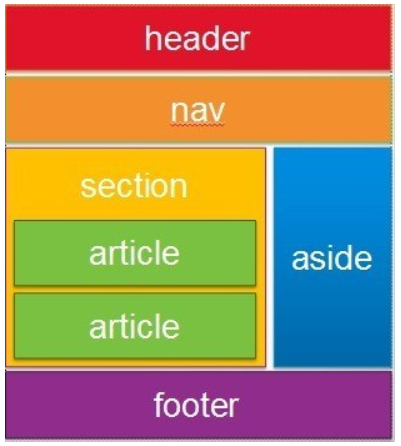

## 2-2) HTML Layout 태그

 

학습 목표
   - 레이아웃(전체 페이지 구성)을 위한 적절한 HTML 태그들을 이해합니다.

### 레이아웃을 위한 태그

레이아웃을 구성하는 태그도 역시 그 의미에 맞춰서 사용됩니다. 

   - header
   - section
   - nav
   - footer
   - aside
  
html태그는 레이아웃을 할 때도 그 의미에 맞는 것을 찾아 사용해야 검색도 더 잘되고, 가독성 있는 코드를 만들 수 있게 됩니다. 

-참고자료-
부스트코스 - 웹프로그래밍

  

