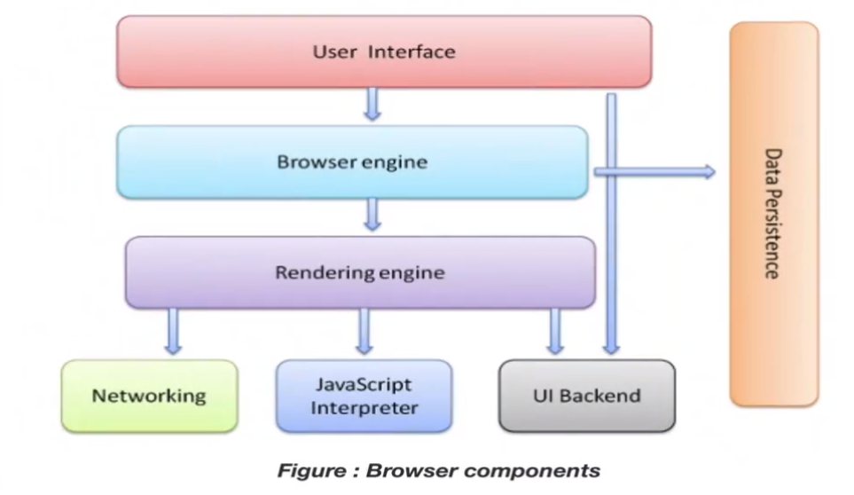
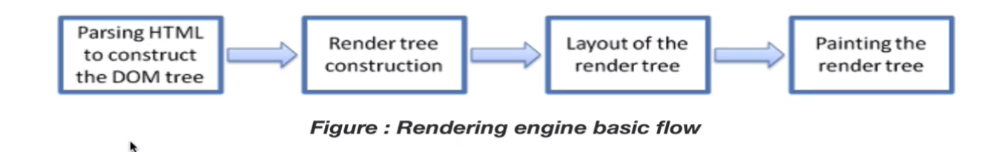
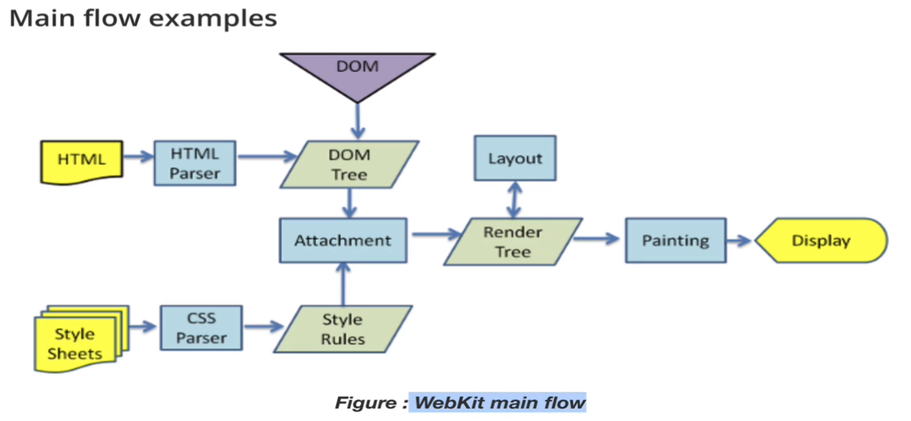
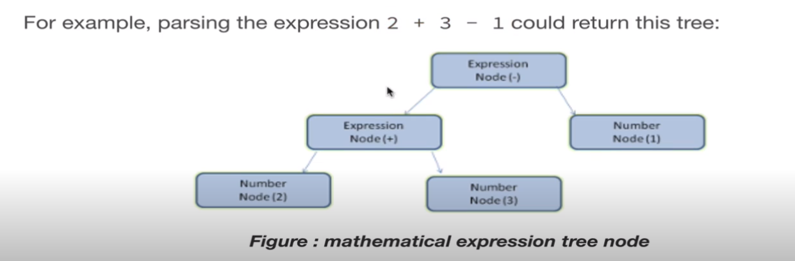
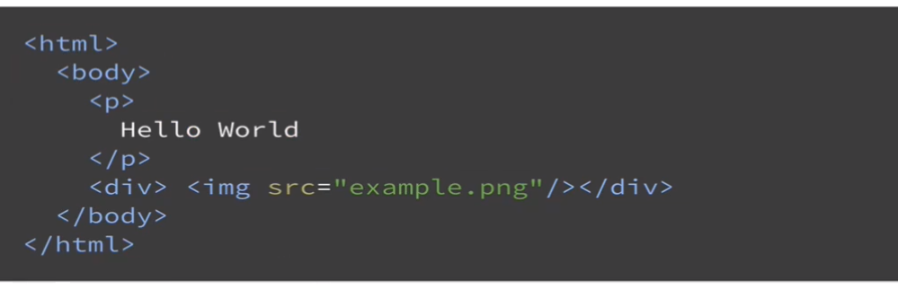
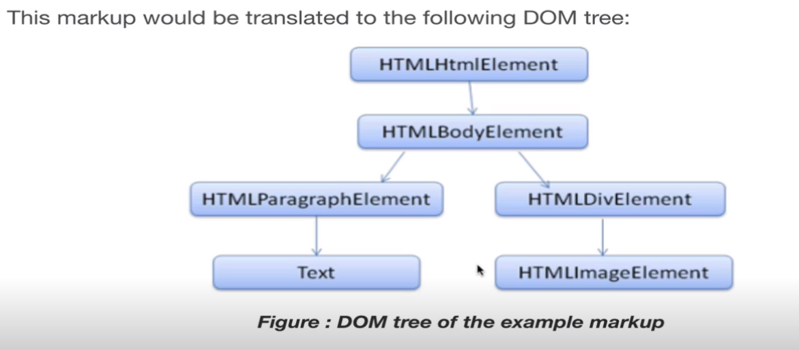
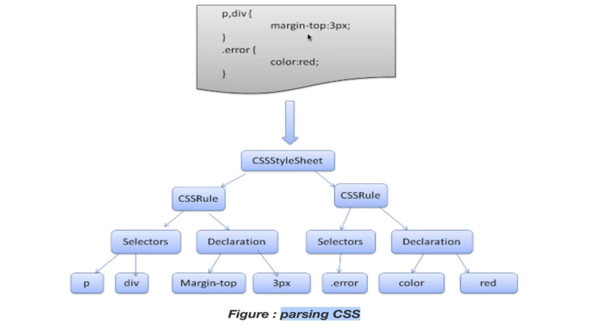

## 1-3) browser의 동작

 

학습 목표
   - HTML파일이 올 때 브라우저가 어떻게 렌더링과정을 거쳐서 화면에 보이게 되는지 간단히 이해한다

User Interface(UI) : 화면에 보이는 것들 뒤로가기버튼(ex 뒤로가는 네비게이션)  
Browser engine : css,html 같은 소스코드를 실행해서 화면에 보여줄 수 있는 엔진  
Rendering engine : 화면에 위치를 잡고 색칠을 해줌 픽셀단위로 어떤것들이 그려져서 우리가 눈으로 다양한 형태를 볼 수 있다.  
(브라우저 소프트웨어를 동작시켜주는 핵심 엔진,브라우저도 일부의 데이터를 캐쉬를 하고 저장을 한다.)  
Networking : 브라우저는 HTTP를 통해서 특정 인터넷 주소를 해석한다음에 그주소로 통신이 필요하다.  
JavaScript interpreter : 자바스크립트 코드를 해석할수 있는 부분  
UI Backend : UI영역을 처리할 수 있는 backend 부분

### Rendering engine
   - Firefox -> Gecko, Safari -> Webkit, Chrome and Opera -> Blink

browser의 main flow

1. Dom tree : Document object model 일종의 트리구조로 html 테그를 가지고 있다.
2. Render tree construction : 랜더 트리를 만든다.
3. Layout of the render tree : 랜더 트리를 기준으로 css를 합친다. 화면에 어떻게 배치할지 즉 첫번째 div 태그는  왼쪽 위  다섯번째 li는 오른쪽 몇픽셀 떨어진 곳에 그린다. 이런것
4. Painting the render tree : 화면에 직접 그림을 그린다.

html 코드를 받고 css 코드를 받고 attachment 두가지를 합쳐서 어떤 엘리먼트에 어떤 스타일을 입히는지 작업을 하고 render tree를 그리고 각각의 dom tree 별로 어떤 스타일 정보를 가지고 있는지 객체화 시키고 키와 벨류로 된 구조로 만드는 것이 일반적인 방법이다. 그다음 layout을 결정하고  크기가 얼만큼인지 결정한다. 그다음 그것에 따라서 화면에 그려주는 painting 작업을 하고 보여준다.

### Parsing-general

기본적인 파싱 방법은 2를 분리하고 + 연산자 그리고 3 또다시 -연산자 그리고 1

 +연산자이면 앞과 뒤를 합쳐준다.
 
 연산자 기준으로 syntax tree를 만들고 값의 처리가 일어난다.(토큰 단위로 짤라서 의미를 해석한 다음에 그것의 의미에 따라서 실행을 해준다.)

 ### HTML PARSER

 HTML 문법은 마크업이라고 한다.

 

마크업은 실제로 브라우저에서  

이와 같은 모습으로 구성되어 있다. 바디안에는 p 태그와 div 태그가 있고 이런것들을 dom 트리라고 표현한다.

css tree

p와 div 부분은 selector라고 하고 오른쪽은 declaration 이라고 한다.
오른쪽은 margin-top이 3px 이야~ 그리고 오른쪽 selector에 .error 가 있고 color는 red이다.

###  생각해보기

우리가 흔히 브라우저 탐색을 할 때 스크롤을 하거나, 어떤 것을 클릭하면서 화면의 위치를 바꿀 때, 브라우저는 어떻게 다시 화면을 그릴까요?
위에서 표현된 그림처럼 다시 렌더링 되지 않을까요? 

재호 예상 답변

HTML,CSS,js 등등 들이 변경되지 않았을 경우에 랜더링이 필요없지만
다른 페이지로 접속하여 문서들이 변경되었을 경우 서버에서 다시
받아들이는 랜더링이 필요할 것 같습니다.

-참고자료-
부스트코스 - 웹프로그래밍
https://www.edwith.org/boostcourse-web/lecture/16663/ 

  

