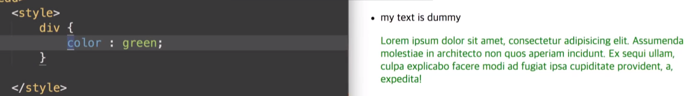

## 3-2) 상속과 우선순위 결정

 

학습 목표
   - CSS 상속의 특징과 상속이 되지 않는 상황에 대해서 이해합니다.

### 상속과 우선순위 결정

~~~
div ul li div p {
    color : 20px;
} 
~~~

이렇게 하면 

이렇게 먹는다.

body > div {}
하면 바디안에 div에 속성을 먹인다는 뜻이다.

Css는 여러가지 스타일정보를 기반으로 최종적으로 경쟁에 의해 적절한 스타일이 반영된다.

선언방식에 따른 차이
(적용순서)
inline > internal > external
          내부         외부

~~~
span{
    color : red;
}
span{
    color : blue;
}
~~~
이렇게 적용이 되면 파랑색이 적용된다.

~~~
body > span{
    color :red;
}
span {
    color :blue;
}
~~~
이렇게 적용되면 red가 적용된다.(구체적으로 표현된것은 먼저 우선해서 표현된다.)

~~~

    text...

#a {
    color : red;
}

.b {
    color : blue;
}
div {

}
~~~

이러면 id 값이 더 높은 점수를 부여받기 떄문에 red가 된다.
그래서 div가 가장 낮고 id 값이 가장 높다.

cascading : 요소는 하나 이상의 CSS 선언에 영향을 받을 수 있다. 이때 충돌을 피하기 위해 CSS 적용 우선순위가 필요한데 이를 캐스캐이딩(Cascading Order)이라고 한다.

캐스캐이딩에는 다음과 같이 세가지 규칙이 있다.

### 중요도
CSS가 어디에 선언 되었는지에 따라서 우선순위가 달라진다.

### 명시도
대상을 명확하게 특정할수록 명시도가 높아지고 우선순위가 높아진다.

### 선언순서
선언된 순서에 따라 우선 순위가 적용된다. 즉, 나중에 선언된 스타일이 우선 적용된다.

  
CSS가 어디에 선언 되었는지에 따라서 우선순위가 달라진다.
 

### 2.1 중요도

head 요소 내의 style 요소
head 요소 내의 style 요소 내의 @import 문
<link> 로 연결된 CSS 파일
<link> 로 연결된 CSS 파일 내의 @import 문
브라우저 디폴트 스타일시트
 

### 2.2 명시도
대상을 명확하게 특정할수록 명시도가 높아지고 우선순위가 높아진다.

!important > 인라인 스타일 > 아이디 선택자 > 클래스/어트리뷰트/가상 선택자 > 태그 선택자 > 전체 선택자 > 상위 요소에 의해 상속된 속성
 

### 2.3 선언순서
선언된 순서에 따라 우선 순위가 적용된다. 즉, 나중에 선언된 스타일이 우선 적용된다.
 

-참고자료-
부스트코스 - 웹프로그래밍

  

