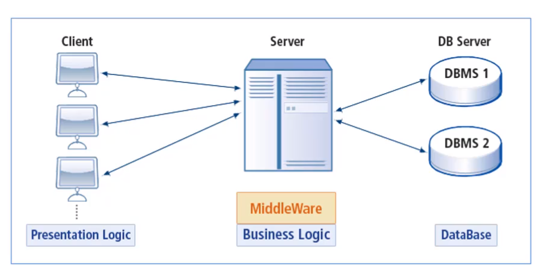
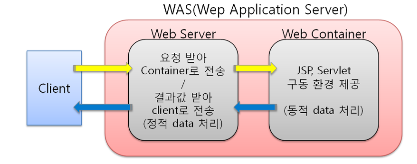

## WAS

 

WAS = Web Application server

(Web Application Server, 약자 WAS)는 웹 애플리케이션과 서버 환경을 만들어 동작시키는 기능을 제공하는 소프트웨어 프레임워크이다. 인터넷 상에서 HTTP를 통해 사용자 컴퓨터나 장치에 애플리케이션을 수행해 주는 미들웨어(소프트웨어 엔진)으로 볼 수 있다. 웹 애플리케이션 서버는 동적 서버 콘텐츠를 수행하는 것으로 일반적인 웹 서버와 구별이 되며, 주로 데이터베이스 서버와 같이 수행이 된다. 한국에서는 일반적으로 "WAS" 또는 "WAS S/W"로 통칭하고 있으며 공공기관에서는 "웹 응용 서버"로 사용되고, 영어권에서는 "Application Server" (약자 AS)로 불린다.

WAS가 가지는 중요한 기능 3가지

   - 프로그램 실행환경과 DB 접속기능
   - 여러개의 트렌젝션을 관리
   - 업무를 처리하는 비즈니스 로직을 처리한다.

DBMS(database management system)

다수의 사용자들이 데이터베이스 내의 데이터를 접근할 수 있도록 해주는 소프트웨어

 

미들웨어(MiddleWare)

클라이언트 쪽에 비즈니스 로직이 많을 경우, 클라이언트 관리로 인해 비용이 많이 발생하는 문제가 발생.

비즈니스 로직을 클라이언트와 DBMS사이의 미들웨어 서버에서 동작하도록 함으로써 클라이언트는 입력과 출력만 담당하도록 함

웹서버 vs WAS

웹서버는 보통 정적인 컨텐츠를 웹브라우저에게 전송하는 역할을 하고 WAS는 프로그램에 동적인 결과를 웹브라우저에게 전송하는 역할을 담당

프로그램이 동작해서 얻은 결과를 보통 동적인 컨텐츠라고 말하곤 한다. 앞으로 was가 제공하는 웹서버의 기능도 웹서버가 제공하는 기능에 비해서 떨어지지 않는다고 했는데 그럼 웹서버가 없어도 될까? 사실 웹서버 없이 Was만으로 정적,동적인 컨텐츠를 모두 제공할 수 있다. was 등장이 초창기였을때 was의 내장된 웹서버가 성능이 좀 떨어져서 초창기에는 웹 어플리케이션을 실행할 때 아파치와 톰켓을 같이설치해서 실행을 했어야만 했는데 계속 발전하면서 웹서버의 역할도 충분히 해주고 있기때문에 웹서버에 따로 설치하지 않아도 충분히 동작하는 경우들이 많아졌다고 생각하면 된다. 그럼에도 불구하고 웹서버가 WAS 앞단에 있으면 좋은 이유가 있기 떄문이다. 웹서버는 상대적으로 was보다 간단한 구조로 만들어져 있어서 사람들이 많이 접속하는 웹 어플리케이션일 경우 서버의 수가 여러대일수가 있다. 우리가 사용하는 프로그램이 문제가 있어서 종료가 될때가 있다. was에서 동작하도록 만들어놓은 프로그램이 오작동이 벌어질경우 was를 재시작 해야하고 문제가 있는 was를 재시작 할때 앞단에 웹서버에서 먼저 해당 was를 이용하지 못하도록하고 was를 재시작한다면 was의 문제가 하였는지 모르고 이용할 수 있다. 이러한 처리를 장애극복기능이라고 하고 대용량 웹어플리케이션에는 무중단으로 운영하기 위해서 상당히 중요한 기능이다. 이러한 기능때문에 보통 웹서버가 was 앞단에서 동작하는 경우가 많다.

생각해보기
톰켓 버전별 차이점에 대해서 알아보세요.

톰캣은 버전별로 서블릿 및 JSP 사양, 요구되는 Java버전이 다르다.

참고
### apache 란?
apach란 것은 소프트웨어 단체 이름이다. 그리고 우리가 흔히 부르는 아파치서버라는 것은 이제단에서 후원하는 오픈소프 프로젝트 커뮤니티에서 만든 http웹서버를 지칭하는 말이다. (아파치 프로젝트는 웹서버 외에도 여러가지 프로젝트를 진행하고 있다고 한다. 이건 추후에 조사해볼것이다.) http 웹서버는 http 요청을 처리할 수 있는 웹서버이고, 아파치 http서버는 http요청을 처리하는 웹서버인 것이다. 클라이언트가 GET, POST, DELETE 등등의 메소드를 이용해 요청을 하면 이 프로그램이 어떤 결과를 돌려주는 기능을 한다. 아파치는 웹서버 이다!

### tomcat 이란?
tomcat은 흔히 WAS(Web Application Server)라고 말한다. WAS는 웹서버와 웹 컨테이너의 결합으로 다양한 기능을 컨테이너에 구현하여 다양한 역할을 수행할 수 있는 서버를 말한다. 클라이언트의 요청이 있을 때 내부의 프로그램을 통해 결과를 만들어내고 이것을 다시 클라이언트에 전달해주는 역할을 하는 것이 바로 웹 컨테이너 이다. 앞에서 본 아파치 웹 서버와 차이는 이 컨테이너 기능이 가능하냐의 차이가 가장 크다고 생각한다.

### 둘의 차이는?
그렇다면 WAS만 쓰면 되지 어째서 웹서버를 따로 쓰느냐는 의문이 생길 수 있다. 그 이유는 목적이 다르기 때문이다. 웹 서버는 정적인 데이터를 처리하는 서버이다. 이미지나 단순 html파일과 같은 리소스를 제공하는 서버는 웹 서버를 통하면 WAS를 이용하는 것보다 빠르고 안정적이다(왜? 다른 글 소스로 써볼까?) WAS는 동적인 데이터를 처리하는 서버이다. DB와 연결되어 데이터를 주고 받거나 프로그램으로 데이터 조작이 필요한 경우에는 WAS를 활용 해야 한다.

-출처-
   - 부스트코스 웹프로그래밍  
   - http://sungbine.github.io/tech/post/2015/02/15/tomcat%EA%B3%BC%20apache%EC%9D%98%20%EC%97%B0%EB%8F%99.html
  
재호 질문 
혹시 WAS가 미들웨어라고 생각해도 될까요? ->yes
그럼 결론적으로 톰켓을 미들웨어라고 봐도 되겠네요? -> yes

mac test

